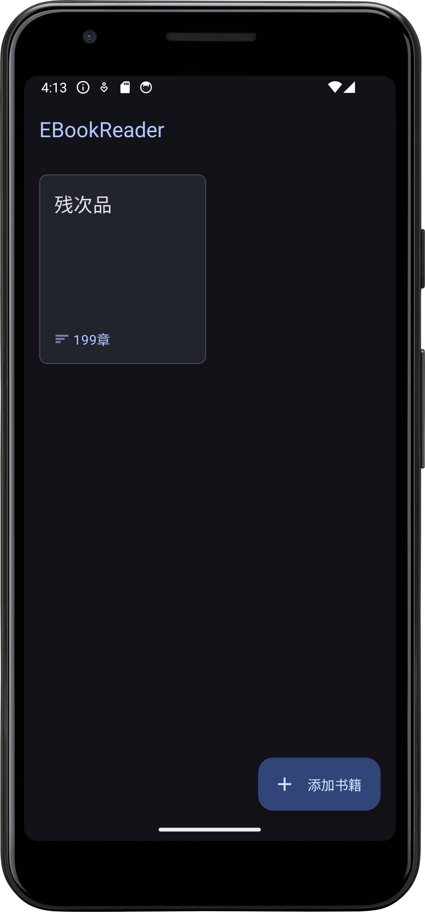
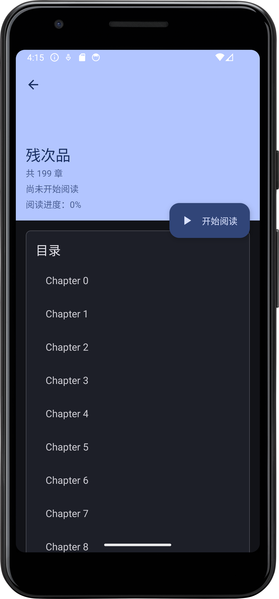
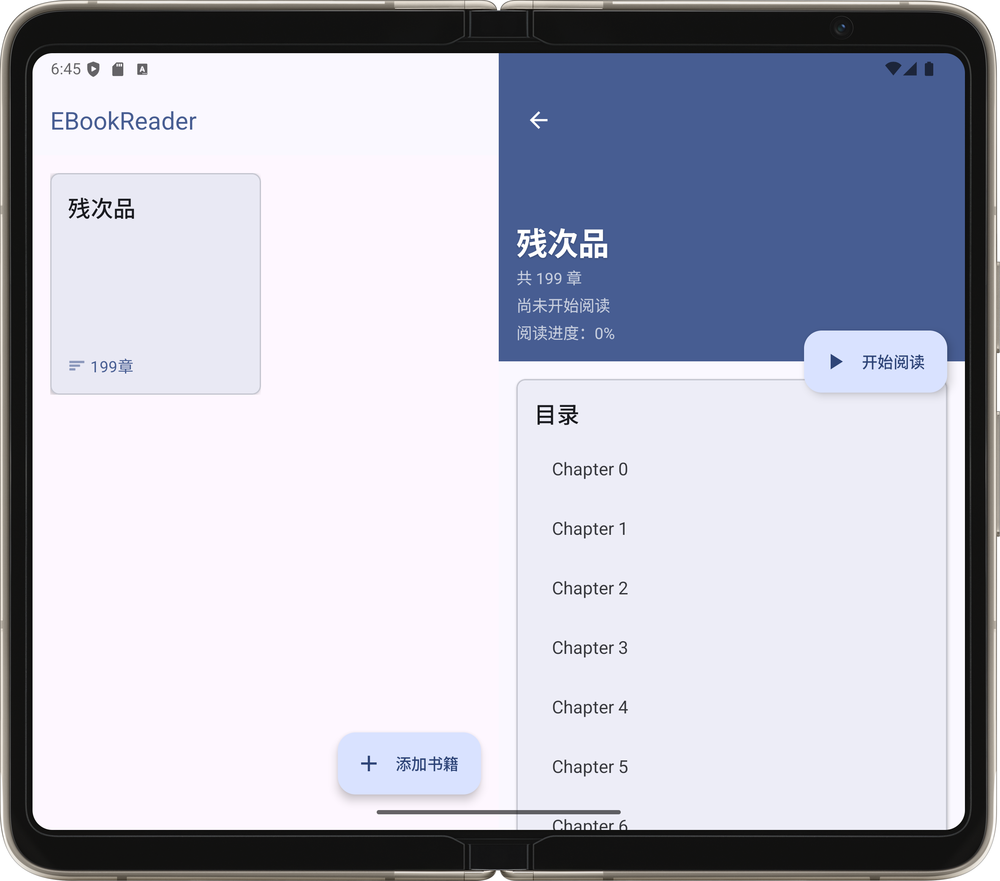
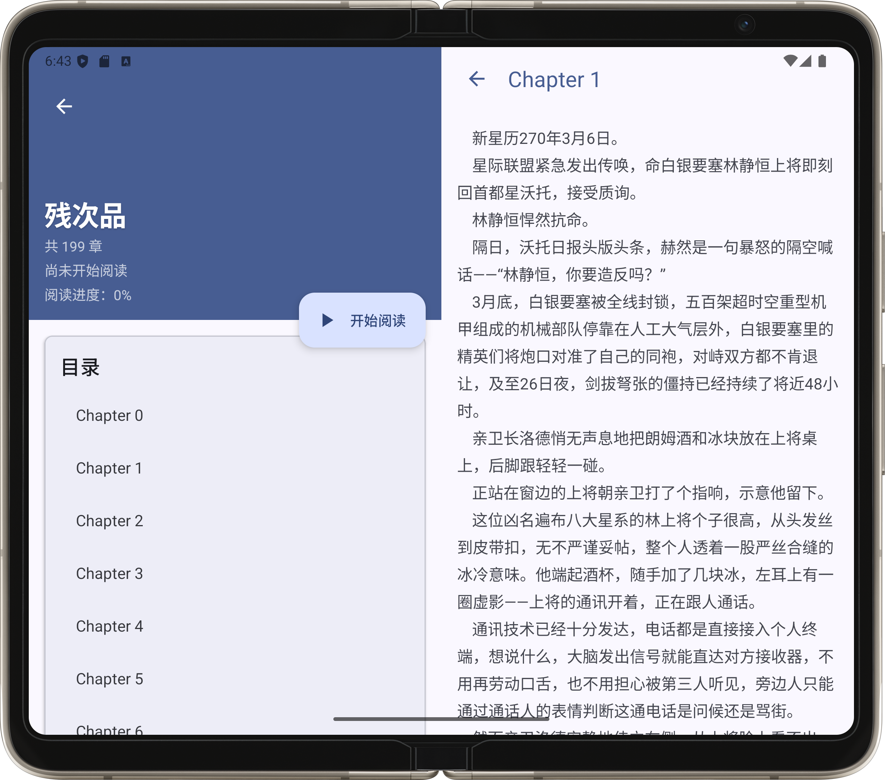

# BIT-Android-EBookReader

[Android技术开发基础](https://bit101.cn/course/4266) 课程作业.

## 展示

基本遵守了 Material Design 3 的最佳实践. 

使用 Fragment 实现了宽屏下左右分屏的界面. 

## 没能做好的功能

- [ ] 数据储存比较混乱, 已读章节数据无实际效果
- [ ] 章节标题解析仍存在问题

## 致谢

大量使用了 Cursor 辅助开发, 虽然不用过脑子写代码摸鱼的感觉很爽, 但总觉得少了点什么. 